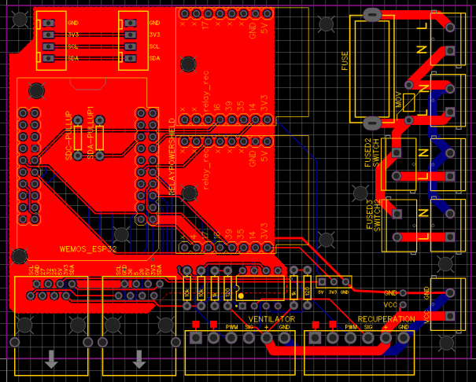
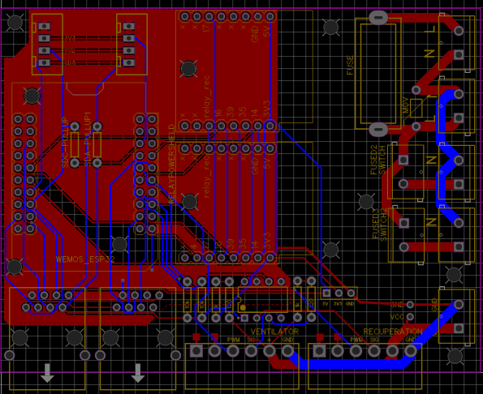
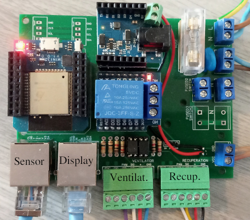

Solar Air Heating Collector using ESP8266
-
This project is home DIY Solar Air Heating Collector System including a recuperation unit for better air quality.

Functionality
--
- WiFi configuration
- Friendly WEB user interface
- One touch button for
  - controlling ventilator and recuperation unit
  - see historical data
- oled display

